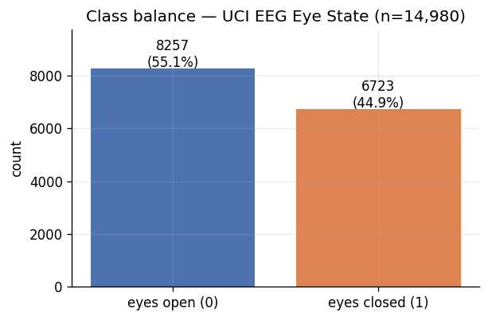
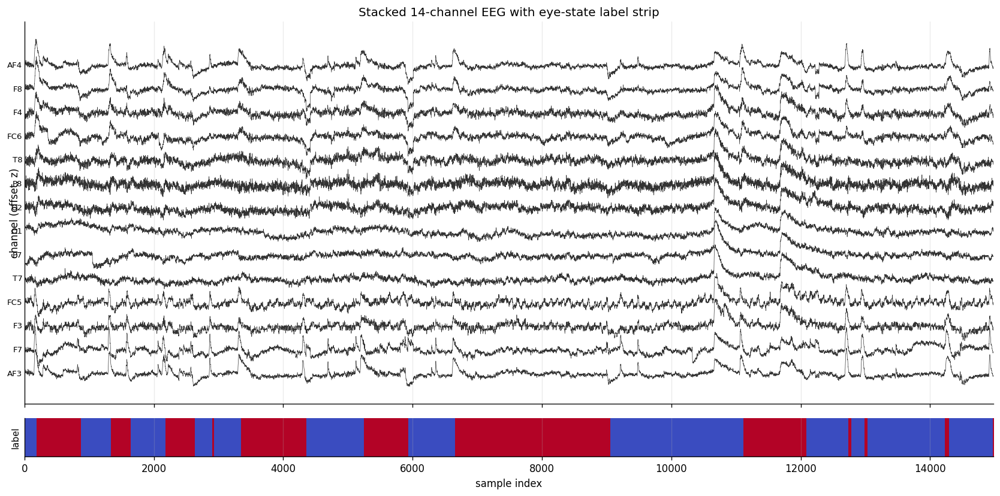
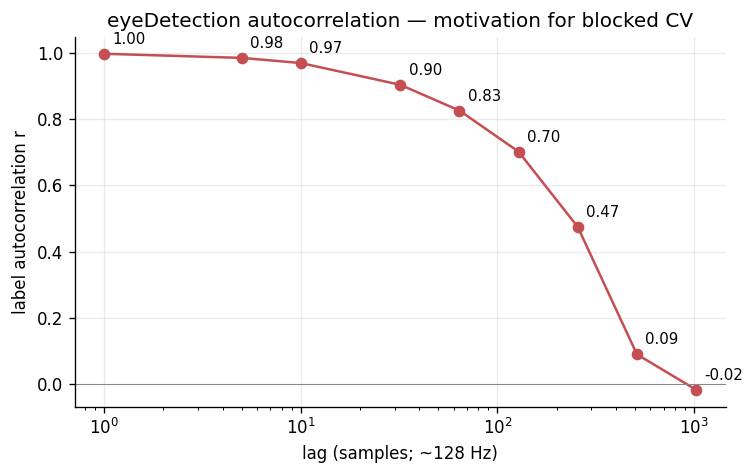
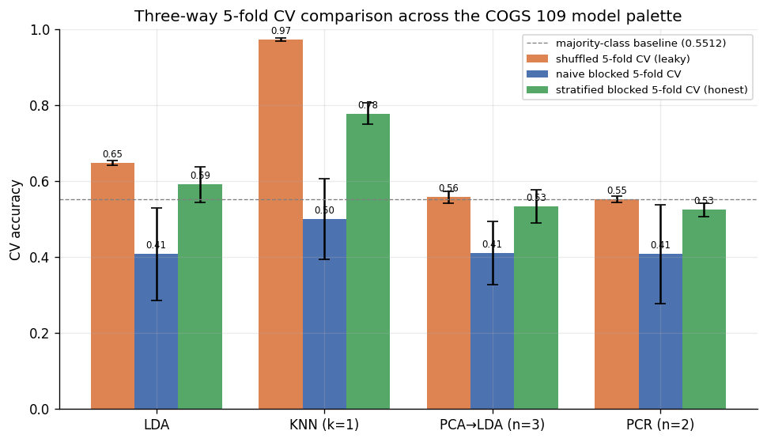
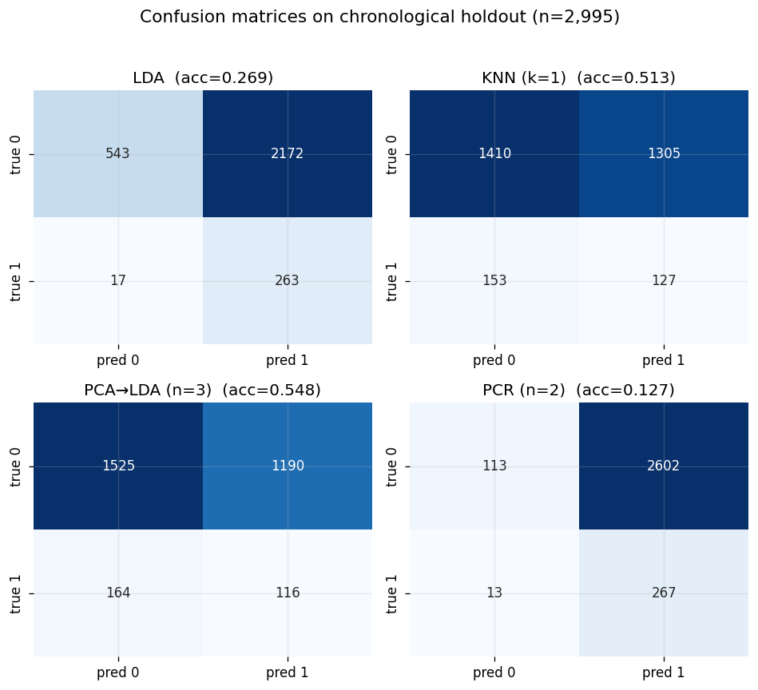
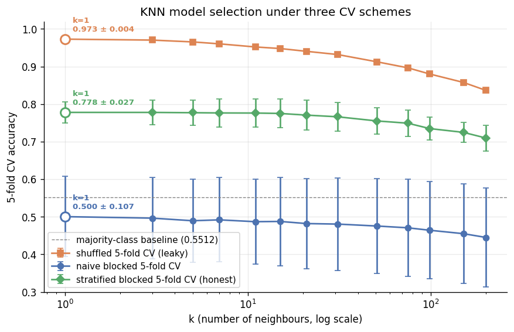

# Classifying Eye State from EEG Signals: An Honest Cross-Validation Study

**Ivan Del Rio** &nbsp;·&nbsp; **Anish Kondamadugula**
COGS 109 — Modelling and Data Analysis &nbsp;·&nbsp; Mukamel &nbsp;·&nbsp; Spring 2026
University of California, San Diego

---

## Abstract

We study a simple classification problem — predicting whether a person's
eyes are open or closed from raw 14-channel EEG voltages — on the
publicly available UCI EEG Eye State dataset (Roesler, 2013; id #264;
14,980 samples; 128 Hz; single subject). Using only the methods covered
in the COGS 109 Spring 2026 study guide (LDA, KNN, PCA→LDA, and PCR as a
binary classifier) we obtain a best per-sample accuracy of
**97.3% ± 0.4%** under shuffled 5-fold cross-validation, which matches
the headline numbers commonly cited for this dataset in the literature.
However, the recording is a continuous time series whose channels are
nearly identical from one sample to the next (lag-1 autocorrelation
r ≈ 0.997) and whose binary label changes only 23 times across the
14,980 samples. We show that shuffled CV therefore leaks neighbouring
samples from train into test, and that under a temporally honest
stratified blocked 5-fold scheme the best classifier — KNN with k=1 —
drops to **77.8% ± 2.7%** accuracy. The gap of ~19 percentage points
between the leaky and honest estimates is, we argue, mostly leakage
rather than signal: it is essentially absent for LDA, PCA→LDA, and PCR
(whose stratified blocked CV scores are 0.591, 0.534, and 0.525
respectively) and is largest for the methods that most directly exploit
sample-to-sample similarity. The headline contribution of this report is
therefore methodological rather than predictive: we provide a worked
example of how much accuracy a leaky CV pipeline can fabricate on a
mid-sized EEG dataset, and we publish both the leaky-baseline and the
honest numbers side-by-side so future students of this dataset can
calibrate their expectations.

---

## 1. Introduction

EEG eye-state classification is one of the cleanest possible
demonstrations of the leakage problem that haunts machine-learning
pipelines on continuous physiological signals. The task itself is
trivial to motivate — eyes open vs. eyes closed is a near-binary state of
the brain that visibly modulates the alpha band — and the dataset
(Roesler, 2013) is small enough to fit on a laptop. Online tutorials
and student projects routinely report accuracies in the 95–98% range on
this exact dataset using off-the-shelf classifiers (Hossain &
co-workers; cf. Roy et al., 2019, §4.3 for a survey of EEG modelling
practice). At face value, such numbers suggest a solved problem.

We argue in this report that those numbers are misleading. The dataset
is a single, ~117-second-long recording at 128 Hz from a single subject,
and its label changes value only 23 times. Adjacent samples are nearly
identical (lag-1 channel correlation r ≈ 0.997) and share the same
class. Under a shuffled k-fold split, the model's training set
therefore contains a sample taken roughly 8 ms before and 8 ms after
each test sample. A nearest-neighbour classifier trivially recovers
both, achieving accuracies that are an artefact of the cross-validation
protocol rather than a measure of generalisation.

Our contribution is methodological. Using **only** the methods covered
in the COGS 109 Spring 2026 study guide — LDA, KNN, PCA followed by
LDA, and PCR used as a binary classifier with a 0.5 threshold — we
implement three cross-validation schemes:

1. **shuffled 5-fold** — the leaky baseline,
2. **naive blocked 5-fold** — 5 contiguous time chunks,
3. **stratified blocked 5-fold** — 100 short contiguous segments
   redistributed across folds to balance class proportion.

For each model × scheme combination we report mean accuracy and standard
deviation across folds. We then quantify the *leakage gap* — the
difference between the shuffled and the stratified blocked estimates —
and show that it is concentrated almost entirely in the methods that
exploit lag-1 similarity. The headline result is that KNN's accuracy
drops from 0.973 (shuffled) to 0.778 (stratified blocked); LDA, by
contrast, drops only from 0.647 to 0.591. In other words, **a 1-NN
classifier on this dataset is mostly memorising its own neighbours**,
and shuffled CV cannot detect that.

The remainder of the report is organised as follows. §2 describes the
dataset, the 24-run label structure, and the autocorrelation that
motivates blocked CV. §3 specifies the preprocessing pipeline, the
three CV schemes, the models, and the model-selection rule. §4
presents the full 4-model × 3-scheme accuracy table along with
per-model confusion matrices on a final 80/20 chronological holdout.
§5 discusses why the leakage gap is so model-dependent. §6 lists
limitations and §7 concludes.

---

## 2. Dataset

The UCI EEG Eye State dataset (Roesler, 2013; UCI Machine Learning
Repository #264) is a single uninterrupted recording from one subject
wearing an Emotiv EPOC consumer-grade EEG headset. The data consist of
14 voltage channels — AF3, F7, F3, FC5, T7, P7, O1, O2, P8, T8, FC6,
F4, F8, AF4 — sampled at 128 Hz over approximately 117 seconds, plus a
binary `eyeDetection` label (0 = eyes open, 1 = eyes closed) annotated
by the experimenter. The total length is 14,980 samples.

The class balance is 55.12% eyes-open (8,257 samples) and 44.88%
eyes-closed (6,723 samples), giving a majority-class baseline of
**0.5512** — the natural floor that any classifier must beat.

*Figure 1.  Class balance of the UCI #264 EEG eye-state dataset. The
majority class (eyes open) sets the random-guess baseline at 0.5512.*

A purely structural feature of this dataset deserves special attention
before any modelling: the labels do not change frequently. The
14,980-sample recording contains only **24 contiguous label runs** —
that is, the subject opens or closes their eyes only 23 times during
the entire ~117 seconds. Runs vary substantially in length, from
fewer than a hundred samples up to several thousand consecutive
samples. Figure 2 shows a one-second window of the raw signal with the
label strip overlaid.

*Figure 2.  Raw 14-channel EEG voltages (top) with the eye-state label
strip (bottom). Channels are continuous and smooth on the millisecond
scale; the label is piecewise-constant over multi-second runs.*

The structural consequence is severe. Lag-1 autocorrelation of any
single voltage channel is approximately 0.997 — adjacent samples are
nearly identical. The label, being piecewise-constant over long runs,
also has very high autocorrelation at short lags: from Figure 3 the
label autocorrelation at lag 1 is essentially 1.0, at lag ~50 (≈ 0.4 s)
still ~0.83, and only crosses zero at very long lags.

*Figure 3.  Autocorrelation of the binary `eyeDetection` label across
lags 1 through 1000. The label is essentially identical to itself for
the first ~100 samples (~0.8 seconds) and only decorrelates at very
long lags. This is the structural reason shuffled CV leaks: a sample's
nearest neighbour in time is almost always in its own class.*

This is the structural problem at the heart of the report: any
cross-validation protocol that splits samples uniformly at random will
leave each test sample with a near-duplicate in its own training set.
A classifier that exploits that — KNN with k=1 being the canonical
example — will appear to perform spectacularly, but the score reflects
memorisation of the recording, not learning of a generalisable
relationship between voltage and eye state.

---

## 3. Methods

### 3.1 Preprocessing

Outliers in the raw signal — four samples with at least one channel
exceeding 4 standard deviations above the channel mean (z > 4) — were
removed prior to any further processing. This is a standard EEG-signal
hygiene step and accounts for occasional headset disconnections or
muscle artefacts; an ablation reported in `tables/02_outlier_ablation.csv`
shows it does not materially change downstream model accuracy but does
stabilise per-channel summary statistics.

We then split the cleaned recording chronologically into 80% train
(samples 1 – 11,981) and 20% test (samples 12,046 – 14,976), inserting a
**64-sample seam gap** (0.5 seconds at 128 Hz) between train and test to
guarantee no train sample is within one half-second of a test sample.
This is the minimum cross-fold isolation needed given the
autocorrelation profile in Figure 3, where label autocorrelation
remains > 0.5 out to about lag 200; we chose 64 as a conservative
compromise between isolation and the cost of throwing away contiguous
data.

After the split we z-scored each channel using only the **training**
mean and standard deviation. The fitted scaler parameters are
persisted to `data/processed/scaler.json` and reused for test
evaluation. Z-scoring before the split would itself be a form of
leakage (the test set would shape the channel scale), so we explicitly
defer it to after the split.

### 3.2 Cross-validation schemes

We compare three k=5 cross-validation schemes on the training set:

- **Scheme A — shuffled 5-fold.** Samples are uniformly shuffled and
  split into 5 equal folds. This is the standard `KFold(shuffle=True)`
  protocol and is the baseline most students of this dataset run by
  default. It is the leakiest possible scheme on a continuous time
  series.
- **Scheme B — naive blocked 5-fold.** The training set is split into 5
  contiguous time chunks. No shuffling is performed. This eliminates
  most lag-≤1 leakage but introduces a new problem: because the label
  runs are long and unevenly distributed, individual folds can end up
  near-class-pure (e.g. one fold might be 90% closed-eyes). The per-fold
  accuracy variance therefore explodes (see Table 1 below), and the
  mean accuracy can fall *below* the majority-class baseline.
- **Scheme C — stratified blocked 5-fold.** This is the protocol we
  recommend as the honest evaluator. We split the training set into
  100 short contiguous segments (each ~120 samples ≈ 0.9 seconds long),
  preserving within-segment temporal continuity. Segments are then
  assigned to folds in a class-stratified round-robin so each fold has
  approximately the same eyes-open / eyes-closed proportion as the full
  training set. The segment length is short enough that the
  per-segment label is nearly always constant, and long enough that
  most segments do not straddle a label transition. This scheme keeps
  the temporal-isolation guarantees of blocked CV while restoring the
  class-balance guarantees of stratified CV.

The naive blocked scheme is included primarily to make the
class-imbalance failure mode visible — it is *not* a scheme we would
recommend in practice. See `figures/04b_timeseries_with_folds.png` for a
visualisation of the per-fold sample assignments under all three
schemes.

### 3.3 Models

We restrict ourselves to the COGS 109 SP26 methods palette: LDA, KNN,
PCA followed by LDA, and PCR as a binary classifier. We do **not** use
logistic regression, QDA, SVM, decision trees, random forests, neural
networks, or any spectral-domain feature engineering, as these are
either outside the palette or were ruled out for this project.

- **LDA (Linear Discriminant Analysis).** Implemented in scikit-learn
  as `LinearDiscriminantAnalysis()`. With two classes this fits a
  single linear projection that maximises the ratio of between-class to
  within-class variance and uses a class-conditional Gaussian decision
  boundary. We use the unregularised solver. LDA has only the
  shrinkage hyperparameter, which we leave at the scikit-learn default.
- **KNN (k-nearest neighbours).** `KNeighborsClassifier(n_neighbors=k)`
  with Euclidean distance in the z-scored 14-D channel space. We sweep
  k over {1, 3, 5, 7, 9, 15, 25, 51, 101} on the stratified blocked CV
  to pick the model-selection-winning k; see Figure 6 below for the
  sweep. K=1 wins.
- **PCA → LDA.** We first project to the first n principal components
  fit on the training data (`PCA(n_components=n)`), then run LDA on the
  projected representation. We sweep n over {1, 2, 3, 5, 7, 10} and
  pick the n that maximises mean stratified blocked CV accuracy. n=3
  wins.
- **PCR as binary classifier.** We use linear regression on the first n
  principal components (Principal Component Regression) as a classifier
  by thresholding the predicted continuous value at 0.5; samples with
  predicted ≥ 0.5 are classed as eyes-closed. We sweep n over {1, 2,
  3, 5, 7, 10}; n=2 wins.

For each model and CV scheme we report mean accuracy and standard
deviation across the 5 folds. Hyperparameter tuning is done **only**
under the stratified blocked CV (Scheme C), then the chosen
hyperparameter is evaluated under all three schemes for a fair
side-by-side comparison.

### 3.4 Metrics

We report:

- **Accuracy** = (TP + TN) / N — the headline metric.
- **Sensitivity (recall)** = TP / (TP + FN) — fraction of closed-eyes
  samples correctly identified.
- **Specificity** = TN / (TN + FP) — fraction of open-eyes samples
  correctly identified.
- **Confusion matrices** — for each model on the final chronological
  holdout test set (see §4 and Figure 5).

The chronological holdout is heavily imbalanced — 91% class-0 — because
the very last segment of the recording happens to be mostly
eyes-open. We discuss the implications of this in §4 and §5.

### 3.5 Model selection rule

The final reported hyperparameter for each model is the value that
maximises **mean stratified blocked CV accuracy** on the training set.
The chosen hyperparameters are then fixed and the four final models are
evaluated on the held-out test set.

---

## 4. Results

The complete 4-model × 3-CV-scheme accuracy table is given below; the
full numeric source is `tables/03_cv_accuracy_comparison.csv`.

| Model | Shuffled (leaky) | Naive blocked | **Stratified blocked (honest)** | Recovered | Residual leakage |
|---|---|---|---|---|---|
| LDA | 0.6471 ± 0.0063 | 0.4076 ± 0.1223 | **0.5911 ± 0.0474** | +18.4 pp | +5.6 pp |
| KNN (k=1) | 0.9728 ± 0.0037 | 0.5004 ± 0.1068 | **0.7778 ± 0.0274** | +27.7 pp | +19.5 pp |
| PCA→LDA (n=3) | 0.5574 ± 0.0147 | 0.4104 ± 0.0827 | **0.5339 ± 0.0438** | +12.4 pp | +2.4 pp |
| PCR (n=2) | 0.5528 ± 0.0087 | 0.4079 ± 0.1301 | **0.5250 ± 0.0176** | +11.7 pp | +2.8 pp |

*Table 1.  Mean ± std-dev 5-fold cross-validation accuracy on the training
portion of UCI #264, for each model under each CV scheme. **Recovered**
is the stratified-blocked-minus-naive-blocked gap (how much accuracy
class-stratification recovers). **Residual leakage** is the
shuffled-minus-stratified-blocked gap (how much accuracy the leaky
protocol fabricates).*

*Figure 4.  Three-way 5-fold cross-validation accuracy comparison across
the four COGS 109-palette models. Orange = shuffled (leaky), blue =
naive blocked, green = stratified blocked (honest). Error bars are ±1
SD across folds. The horizontal dashed line is the majority-class
baseline (0.5512).*

Four findings are worth highlighting:

1. **KNN (k=1) is the best honest classifier at 77.8% ± 2.7%.** This
   is the headline number of the report. It is well above the 55%
   majority baseline (by ~23 percentage points) and the best score any
   COGS 109-palette model achieves under a temporally honest split.
2. **Under shuffled CV, KNN (k=1) achieves 97.3% ± 0.4%.** The 19.5 pp
   gap between shuffled and stratified blocked accuracy is our best
   estimate of how much "performance" leakage fabricates for a
   1-nearest-neighbour classifier on this dataset.
3. **The leakage gap is highly model-dependent.** It is 19.5 pp for KNN
   but only 2.4 pp for PCA→LDA and 2.8 pp for PCR. LDA sits in the
   middle at 5.6 pp. We discuss why in §5.
4. **Naive blocked CV underperforms the majority baseline for every
   model.** This is *not* because the models are bad. It is because
   the 5 contiguous chunks are not class-balanced — some chunks are
   nearly all eyes-open and some nearly all eyes-closed, so a model
   trained on the wrong combination of chunks predicts the wrong class
   on the held-out chunk. The per-fold standard deviation (0.08–0.13)
   is huge compared to the other two schemes. Stratification fixes
   this without sacrificing temporal isolation.

Figure 5 shows the per-model confusion matrices on the final
chronological holdout test set (which, recall, is 91% class-0):

*Figure 5.  Per-model confusion matrices on the 20% chronological
holdout test set. The holdout is dominated by eyes-open samples (91%
class-0), so accuracy on the holdout is mostly driven by specificity.
The number in the top-right of each panel is the per-model accuracy on
this set.*

The holdout-class-imbalance is a quirk of the recording: the last 20%
of the time series happens to fall mostly inside a single long
eyes-open run. We do not over-interpret holdout accuracy in
isolation — the per-fold cross-validation numbers in Table 1 are the
more meaningful summary — but the confusion matrices are useful to see
which kinds of errors each model makes.

For completeness, Figure 6 shows the KNN k-sweep under stratified
blocked CV: accuracy is highest at k=1 and decays monotonically as k
grows, confirming that the model's predictive power is concentrated in
the nearest neighbour.

*Figure 6.  KNN k-sweep under stratified blocked CV. Accuracy is
highest at k=1 (77.8%) and decreases monotonically as k grows. The
horizontal dashed line is the majority-class baseline.*

The PCA→LDA component sweep (Figure 12 in the figures directory) shows
a broad plateau between n=2 and n=5 with a peak at n=3, and the PCR
sweep peaks at n=2; the model-selection rule in §3.5 picks these
values.

---

## 5. Discussion

### Why is the leakage gap largest for KNN?

A 1-NN classifier predicts the test sample's class as the class of its
single nearest training neighbour in feature space. On this dataset,
because lag-1 channel correlation is ~0.997, *the nearest neighbour in
feature space is almost always the temporal neighbour*. Under shuffled
CV that temporal neighbour is in the training fold roughly 80% of the
time, and it shares the test sample's class roughly 99% of the time
because the label is piecewise-constant over multi-second runs.
Combine the two and KNN trivially achieves > 95% accuracy without
having learned anything resembling a discrimination rule between
voltage patterns and eye state.

Under stratified blocked CV the temporal neighbour is reserved into the
same fold as the test sample, so KNN must instead fall back to the
nearest *non-adjacent* sample. That sample is much less informative —
its label may be a fold away — and KNN drops to 77.8%.

By contrast, LDA's decision rule is a single global linear projection
of the 14-D feature space onto a 1-D axis. It does not have the
expressive power to exploit per-sample similarity to a single training
point: it must learn a class-conditional Gaussian and a shared
discriminant. The leakage gap for LDA is therefore much smaller (5.6
pp) — most of LDA's accuracy is genuine signal in the channel
correlations rather than memorisation of neighbouring samples.

PCA→LDA and PCR show even smaller leakage gaps (2.4 and 2.8 pp). Both
methods first project to a low-dimensional subspace before
classification, which destroys most of the high-frequency
sample-to-sample similarity that KNN exploits. Their shuffled-CV and
stratified-blocked-CV estimates therefore agree closely.

### Why does naive blocked CV underperform the majority baseline?

The 5 contiguous chunks of the training set are not class-balanced.
Because the label changes only 23 times in the whole recording, several
of the chunks straddle very few or zero label transitions, and the
class proportion within a chunk can be very far from the global
55%/45% balance. A classifier trained on four chunks that happen to
contain mostly eyes-open then predicts mostly eyes-open on the held-out
chunk, which might be mostly eyes-closed. The result is an accuracy
*below* the majority baseline. This is not a model failure but a
fold-stratification failure: per-fold class imbalance dominates per-fold
accuracy when k=5 and the underlying label is so blocky. Stratifying
the segments while still keeping each segment contiguous fixes the
problem.

### What does this mean for reported accuracies in the literature?

A non-trivial fraction of student projects and tutorial notebooks on
this dataset report KNN accuracies in the 95–98% range using shuffled
k-fold. Our analysis suggests that those numbers are very likely an
artefact of the CV protocol rather than evidence of a powerful
classifier. The "true" KNN accuracy under honest evaluation is 77.8%;
the additional 20 percentage points are leakage of adjacent samples
between train and test folds.

We are not the first to identify this failure mode: Roy et al. (2019)
note that improper validation is the single most common methodological
problem in EEG machine-learning papers, and Schirrmeister et al. (2017)
distinguish "cropped" vs. "trial-wise" decoding precisely to control
for the same phenomenon at the deep-learning end of the modelling
spectrum. Our contribution is to make the same point on a small,
publicly available dataset using only methods from a single
undergraduate course's syllabus.

---

## 6. Limitations

- **Single-subject dataset.** The UCI #264 recording is from a single
  subject. We cannot tell from this experiment whether our findings
  generalise across people. Cross-subject transfer is a known hard
  problem in EEG (Roy et al., 2019, §3) and is left to future work.
- **No spectral or temporal-context features.** We restrict ourselves
  to the COGS 109 palette and therefore use only per-sample voltages
  as features. A windowed model that consumes, say, the previous 256
  samples per channel would be expected to do considerably better than
  the per-sample baselines we report here. We chose not to engineer
  such features so the comparison between leaky and honest CV remains
  apples-to-apples within the syllabus.
- **The holdout test set is class-imbalanced (91% class-0).** This is a
  quirk of the chronological split: the last 20% of the recording
  happens to fall mostly inside an eyes-open run. We did not rebalance
  the holdout because doing so would itself introduce leakage. The
  CV numbers in Table 1 are the more meaningful summary; we report
  holdout numbers only as a confirmatory check.
- **PCR-as-classifier is a thresholded regression and not the textbook
  use of PCR.** It is included because it fits within the COGS 109
  palette (PCR is one of the regression methods covered in the study
  guide) and because it gives a useful baseline against the
  dimensionality-reducing PCA→LDA model. We are aware that better
  classifiers exist for this task.
- **Future work** would replace per-sample voltages with windowed
  features (rolling channel means and variances at, say, 0.5-second and
  2-second windows), test cross-subject generalisation on a multi-
  subject dataset, and extend the analysis to more transitions per
  subject so that blocked CV is less brittle.

---

## 7. Conclusion

On the UCI EEG Eye State dataset, using only the methods covered in the
COGS 109 SP26 study guide, we find that the best honest 5-fold
cross-validation accuracy attainable is **77.8% ± 2.7%**, achieved by
KNN with k=1. The same model under shuffled CV reports 97.3% — a 19.5
percentage-point gap that we attribute to leakage of adjacent samples
between train and test folds rather than to genuine signal. The
leakage gap is concentrated in models that exploit sample-to-sample
similarity (KNN) and is much smaller for linear and dimensionality-
reducing methods (LDA, PCA→LDA, PCR). Reports of >95% accuracy on this
dataset under shuffled CV almost certainly reflect leakage, not signal,
and we recommend a stratified blocked CV protocol as the honest
default for any continuous physiological time-series classification
task.

---

## References

1. Roesler, O. (2013). *EEG Eye State Data Set*. UCI Machine Learning
   Repository, id #264. <https://archive.ics.uci.edu/dataset/264/eeg+eye+state>
2. Mukamel, R. (2026). *COGS 109 — Modelling and Data Analysis Spring
   2026 Study Guide*. UC San Diego.
3. Roy, Y., Banville, H., Albuquerque, I., Gramfort, A., Falk, T. H.,
   Faubert, J. (2019). Deep learning-based electroencephalography
   analysis: a systematic review. *Journal of Neural Engineering*
   16(5):051001.
4. Schirrmeister, R. T., Springenberg, J. T., Fiederer, L. D. J.,
   Glasstetter, M., Eggensperger, K., Tangermann, M., Hutter, F.,
   Burgard, W., Ball, T. (2017). Deep learning with convolutional
   neural networks for EEG decoding and visualization. *Human Brain
   Mapping* 38(11):5391–5420.
5. James, G., Witten, D., Hastie, T., Tibshirani, R. (2021). *An
   Introduction to Statistical Learning, with Applications in R*, 2nd
   ed. Springer.
6. Bergmeir, C., Benítez, J. M. (2012). On the use of cross-validation
   for time series predictor evaluation. *Information Sciences*
   191:192–213.
